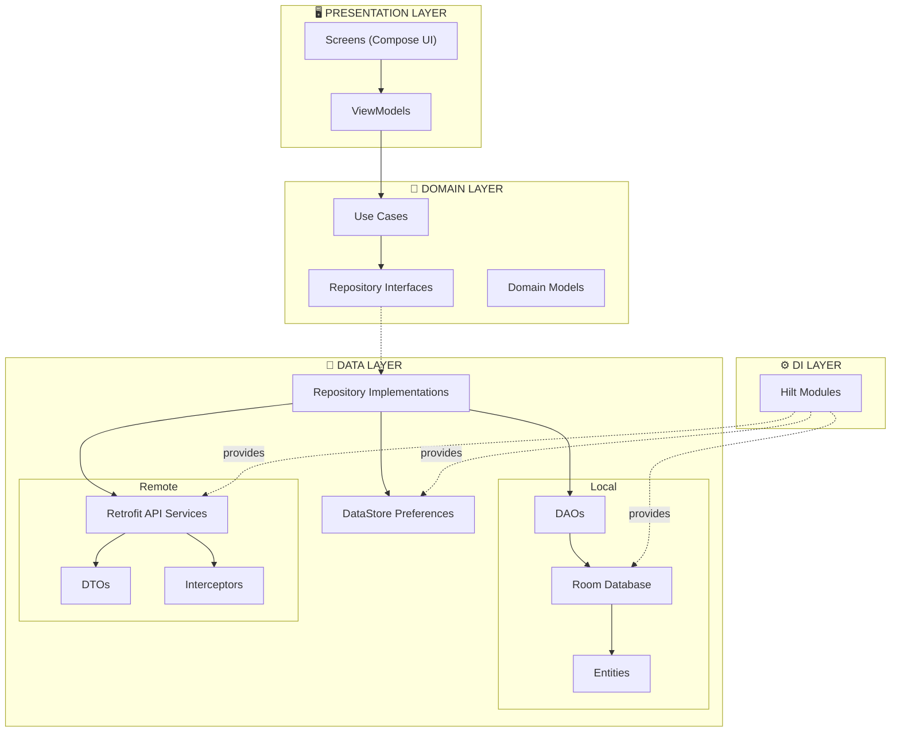
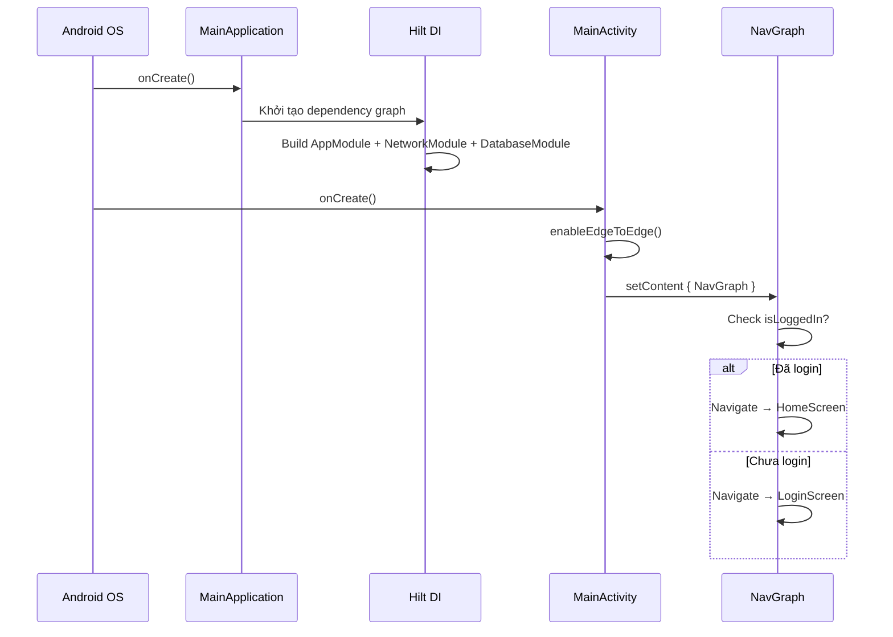
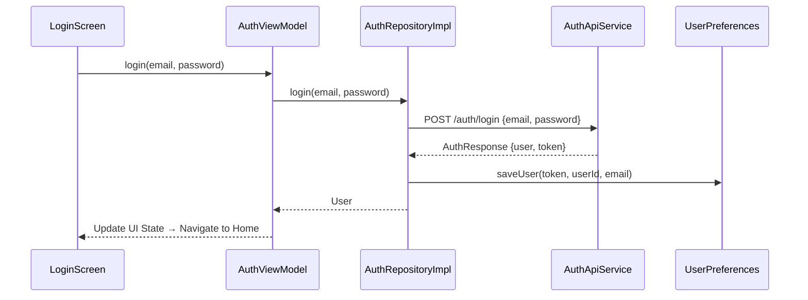
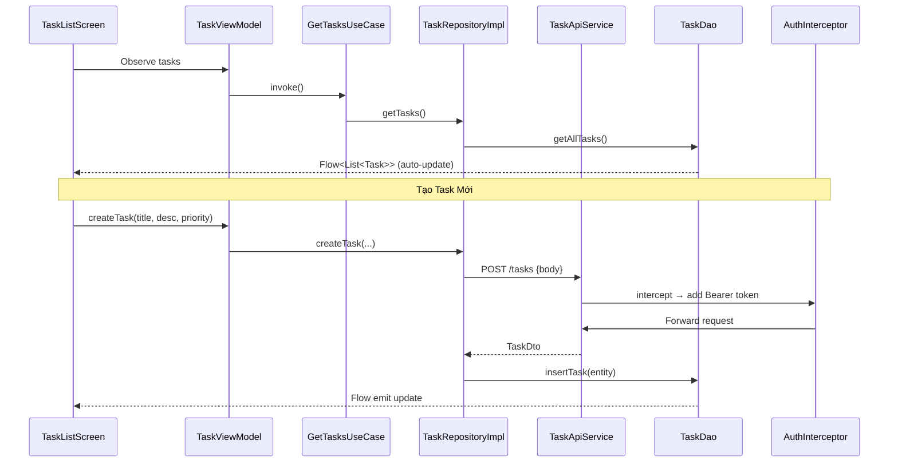
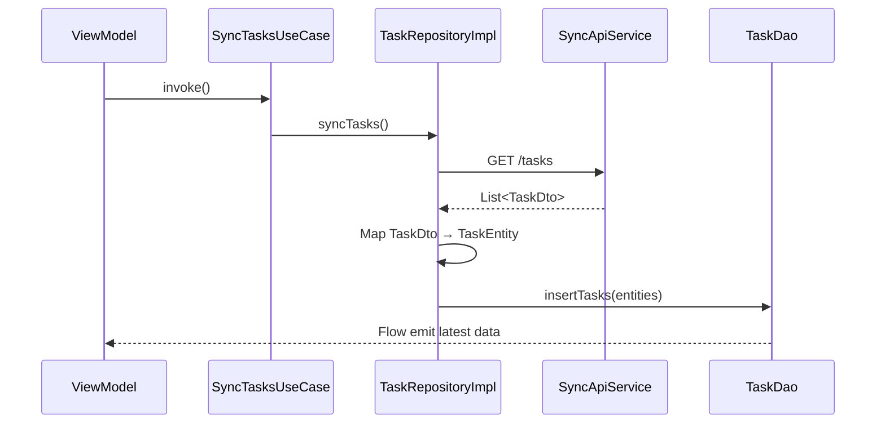
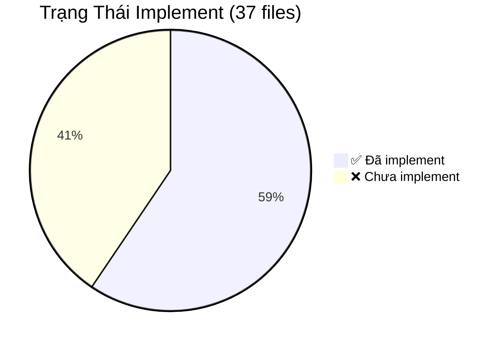

# 📱 Android Task Manager — Kiến Trúc & Luồng Hoạt Động

## Tổng Quan Kiến Trúc

Project sử dụng **Clean Architecture + MVVM** với **Hilt** cho Dependency Injection.

---

## 📁 Chi Tiết Từng File

### 🏠 Root — Entry Points

#### `MainApplication.kt` ✅ Đã implement
| Thuộc tính | Chi tiết |
|---|---|
| **Chức năng** | Entry point của ứng dụng, khởi tạo Hilt DI container |
| **Annotation** | `@HiltAndroidApp` — trigger Hilt code generation |
| **Luồng** | Android OS → `MainApplication.onCreate()` → Hilt khởi tạo dependency graph |

#### `MainActivity.kt` ✅ Đã implement
| Thuộc tính | Chi tiết |
|---|---|
| **Chức năng** | Activity chính, host Jetpack Compose UI |
| **Annotation** | `@AndroidEntryPoint` — cho phép inject dependencies |
| **Luồng** | `MainApplication` → `MainActivity.onCreate()` → `setContent { Scaffold }` |
| **Lưu ý** | Hiện chỉ hiển thị "Hello Android!", chưa tích hợp NavGraph |

---

### 💾 Data Layer — Local (Room Database)

#### `data/local/entity/TaskEntity.kt` ✅ Đã implement
| Thuộc tính | Chi tiết |
|---|---|
| **Table** | `tasks` |
| **Chức năng** | Định nghĩa bảng tasks trong SQLite |
| **Fields** | `id` (PK), `title`, `description?`, `priority`, `completed`, `dueDate?`, `categoryId`, `userId`, `createdAt`, `updatedAt` |

#### `data/local/entity/CategoryEntity.kt` ✅ Đã implement
| Thuộc tính | Chi tiết |
|---|---|
| **Table** | `categories` |
| **Chức năng** | Định nghĩa bảng categories |
| **Fields** | `id` (PK), `name`, `color?`, `userId`, `createdAt` |

#### `data/local/entity/PomodoroEntity.kt` ✅ Đã implement
| Thuộc tính | Chi tiết |
|---|---|
| **Table** | `pomodoros` |
| **Chức năng** | Định nghĩa bảng pomodoro sessions |
| **Fields** | `id` (PK), `duration`, `completed`, `taskId`, `userId`, `createdAt` |

#### `data/local/dao/TaskDao.kt` ✅ Đã implement
| Thuộc tính | Chi tiết |
|---|---|
| **Chức năng** | Data Access Object cho bảng `tasks` |
| **Operations** | `getAllTasks()` → `Flow<List>`, `getTaskById()`, `insertTask()`, `insertTasks()`, `updateTask()`, `deleteTask()`, `deleteAllTasks()` |
| **Đặc biệt** | `getAllTasks()` trả về `Flow` — tự động emit khi data thay đổi |

#### `data/local/dao/CategoryDao.kt` ✅ Đã implement
| Thuộc tính | Chi tiết |
|---|---|
| **Chức năng** | DAO cho bảng `categories` |
| **Operations** | `getAllCategories()` → `Flow<List>`, `insertCategory()`, `insertCategories()`, `deleteCategory()`, `deleteAllCategories()` |

#### `data/local/dao/PomodoroDao.kt` ✅ Đã implement
| Thuộc tính | Chi tiết |
|---|---|
| **Chức năng** | DAO cho bảng `pomodoros` |
| **Operations** | `getAllPomodoros()` → `Flow<List>`, `insertPomodoro()`, `deleteAllPomodoros()` |

#### `data/local/AppDatabase.kt` ✅ Đã implement
| Thuộc tính | Chi tiết |
|---|---|
| **Chức năng** | Room Database chính, quản lý 3 bảng |
| **Entities** | `TaskEntity`, `CategoryEntity`, `PomodoroEntity` |
| **Version** | 1 |
| **Expose** | `taskDao()`, `categoryDao()`, `pomodoroDao()` |

---

### 💾 Data Layer — Remote (Retrofit + OkHttp)

#### `data/remote/dto/TaskDto.kt` ✅ Đã implement
| Thuộc tính | Chi tiết |
|---|---|
| **Chức năng** | Data Transfer Objects cho Task API |
| **Classes** | `TaskDto` (response), `CreateTaskRequest` (POST body), `UpdateTaskRequest` (PUT body) |
| **Luồng** | Backend JSON → Gson → `TaskDto` → map to `Task` domain model |

#### `data/remote/dto/UserDto.kt` ✅ Đã implement
| Thuộc tính | Chi tiết |
|---|---|
| **Chức năng** | DTOs cho Auth API |
| **Classes** | `UserDto` (user info), `RegisterRequest`, `LoginRequest`, `AuthResponse` (chứa `UserDto` + `token`) |

> [!NOTE]
> `SyncApiService.kt` tham chiếu đến `CategoryDto` nhưng class này **chưa được tạo** trong `UserDto.kt` hay file riêng. Cần bổ sung.

#### `data/remote/api/TaskApiService.kt` ✅ Đã implement
| Thuộc tính | Chi tiết |
|---|---|
| **Chức năng** | Retrofit interface cho Task CRUD |
| **Endpoints** | `GET /tasks`, `GET /tasks/{id}`, `POST /tasks`, `PUT /tasks/{id}`, `DELETE /tasks/{id}` |
| **Base URL** | `http://10.0.2.2:3000/` (Android emulator → localhost) |

#### `data/remote/api/AuthApiService.kt` ✅ Đã implement
| Thuộc tính | Chi tiết |
|---|---|
| **Chức năng** | Retrofit interface cho Authentication |
| **Endpoints** | `POST /auth/register`, `POST /auth/login`, `POST /auth/logout` |

#### `data/remote/api/SyncApiService.kt` ✅ Đã implement
| Thuộc tính | Chi tiết |
|---|---|
| **Chức năng** | Retrofit interface cho đồng bộ dữ liệu |
| **Endpoints** | `GET /tasks` (sync tasks), `GET /categories` (sync categories) |

#### `data/remote/interceptor/AuthInterceptor.kt` ✅ Đã implement
| Thuộc tính | Chi tiết |
|---|---|
| **Chức năng** | Tự động gắn JWT token vào header mỗi HTTP request |
| **Luồng** | Request → đọc token từ `UserPreferences` (DataStore) → thêm `Authorization: Bearer <token>` → forward request |
| **Lưu ý** | Dùng `runBlocking` để đọc Flow trong synchronous context (OkHttp interceptor) |

#### `data/remote/interceptor/LoggingInterceptor.kt` ✅ Đã implement
| Thuộc tính | Chi tiết |
|---|---|
| **Chức năng** | Log toàn bộ HTTP request/response body (debug) |
| **Level** | `BODY` — log headers + body |

---

### 💾 Data Layer — Repository & DataStore

#### `data/datastore/UserPreferences.kt` ✅ Đã implement
| Thuộc tính | Chi tiết |
|---|---|
| **Chức năng** | Quản lý user session (token, userId, email) bằng DataStore |
| **Lưu trữ** | `jwt_token`, `user_id`, `user_email` |
| **Operations** | `saveUser(token, userId, email)`, `clearUser()` |
| **Expose** | `token: Flow<String?>`, `userId: Flow<String?>`, `userEmail: Flow<String?>` |

#### `data/repository/TaskRepositoryImpl.kt` ❌ Chưa implement
| Thuộc tính | Chi tiết |
|---|---|
| **Chức năng dự kiến** | Implement `TaskRepository` interface, kết hợp local (Room) + remote (Retrofit) |
| **Luồng dự kiến** | UseCase → `TaskRepositoryImpl` → API call + cache vào Room |

#### `data/repository/AuthRepositoryImpl.kt` ❌ Chưa implement
| Thuộc tính | Chi tiết |
|---|---|
| **Chức năng dự kiến** | Implement `AuthRepository` interface, xử lý login/register + lưu token |

---

### 🧠 Domain Layer — Models

#### `domain/model/Task.kt` ✅ Đã implement
| Fields | `id`, `title`, `description?`, `priority`, `completed`, `dueDate?`, `categoryId?`, `userId`, `createdAt`, `updatedAt` |
|---|---|
| **Chức năng** | Domain model cho Task — không phụ thuộc framework |

#### `domain/model/Category.kt` ✅ Đã implement
| Fields | `id`, `name`, `color?`, `userId`, `createdAt` |
|---|---|

#### `domain/model/User.kt` ✅ Đã implement
| Fields | `id`, `email`, `name?`, `token` |
|---|---|

---

### 🧠 Domain Layer — Repository Interfaces

#### `domain/repository/TaskRepository.kt` ✅ Đã implement
| Thuộc tính | Chi tiết |
|---|---|
| **Chức năng** | Contract cho Task data operations |
| **Methods** | `getTasks()`, `getTaskById()`, `createTask()`, `updateTask()`, `deleteTask()`, `syncTasks()` |

#### `domain/repository/AuthRepository.kt` ✅ Đã implement
| Thuộc tính | Chi tiết |
|---|---|
| **Chức năng** | Contract cho Auth operations |
| **Methods** | `register()`, `login()`, `logout()`, `getToken()`, `isLoggedIn()` |

---

### 🧠 Domain Layer — Use Cases

#### `domain/usecase/task/GetTasksUseCase.kt` ✅ Đã implement
| Thuộc tính | Chi tiết |
|---|---|
| **Input** | Không |
| **Output** | `Flow<List<Task>>` |
| **Luồng** | ViewModel gọi `invoke()` → `TaskRepository.getTasks()` → emit liên tục khi data thay đổi |

#### `domain/usecase/task/CreateTaskUseCase.kt` ✅ Đã implement
| Thuộc tính | Chi tiết |
|---|---|
| **Input** | `title`, `description?`, `priority`, `dueDate?`, `categoryId?` |
| **Output** | `Task` |
| **Validation** | Kiểm tra `title` không được blank |
| **Luồng** | ViewModel → validate → `TaskRepository.createTask()` → trả về Task mới |

#### `domain/usecase/task/UpdateTaskUseCase.kt` ✅ Đã implement
| Thuộc tính | Chi tiết |
|---|---|
| **Input** | `id`, `title?`, `description?`, `priority?`, `completed?`, `categoryId?` |
| **Output** | `Task` |
| **Luồng** | ViewModel → `TaskRepository.updateTask()` → trả về Task đã cập nhật |

#### `domain/usecase/task/DeleteTaskUseCase.kt` ✅ Đã implement
| Thuộc tính | Chi tiết |
|---|---|
| **Input** | `id: String` |
| **Luồng** | ViewModel → `TaskRepository.deleteTask(id)` |

#### `domain/usecase/sync/SyncTasksUseCase.kt` ✅ Đã implement
| Thuộc tính | Chi tiết |
|---|---|
| **Chức năng** | Đồng bộ tasks từ server về local |
| **Luồng** | ViewModel → `TaskRepository.syncTasks()` → pull từ API → lưu vào Room |

---

### ⚙️ DI Layer — Hilt Modules

#### `di/AppModule.kt` ✅ Đã implement
| Thuộc tính | Chi tiết |
|---|---|
| **Provides** | `DataStore<Preferences>` (Singleton) |
| **Tên file** | `user_prefs` |
| **Luồng** | Hilt inject `DataStore` → `UserPreferences` → `AuthInterceptor` / Repositories |

#### `di/NetworkModule.kt` ✅ Đã implement
| Thuộc tính | Chi tiết |
|---|---|
| **Base URL** | `http://10.0.2.2:3000/` (emulator → localhost:3000) |
| **Provides** | `OkHttpClient` (với Auth + Logging interceptors), `Retrofit`, `AuthApiService`, `TaskApiService`, `SyncApiService` |
| **Luồng** | Hilt → tạo `OkHttpClient` (inject interceptors) → tạo `Retrofit` → tạo API services |

#### `di/DatabaseModule.kt` ✅ Đã implement
| Thuộc tính | Chi tiết |
|---|---|
| **DB Name** | `aitaskmanager.db` |
| **Provides** | `AppDatabase` (Singleton), `TaskDao`, `CategoryDao`, `PomodoroDao` |
| **Luồng** | Hilt → `Room.databaseBuilder()` → expose DAOs |

---

### 🖥️ Presentation Layer — Tất cả ❌ Chưa implement

| File | Chức năng dự kiến |
|---|---|
| `ui/auth/LoginScreen.kt` | Màn hình đăng nhập (email + password) |
| `ui/auth/RegisterScreen.kt` | Màn hình đăng ký tài khoản |
| `ui/auth/AuthViewModel.kt` | Quản lý state auth, gọi AuthRepository |
| `ui/home/HomeScreen.kt` | Màn hình chính, dashboard tổng quan |
| `ui/home/HomeViewModel.kt` | Load dữ liệu tổng hợp cho home |
| `ui/task/TaskListScreen.kt` | Danh sách tasks, filter/sort |
| `ui/task/TaskDetailScreen.kt` | Chi tiết 1 task |
| `ui/task/CreateTaskScreen.kt` | Form tạo task mới |
| `ui/task/TaskViewModel.kt` | CRUD tasks qua Use Cases |
| `ui/pomodoro/PomodoroScreen.kt` | Timer Pomodoro |
| `ui/pomodoro/PomodoroViewModel.kt` | Quản lý countdown + sessions |
| `ui/settings/SettingsScreen.kt` | Cài đặt ứng dụng |
| `ui/settings/SettingsViewModel.kt` | Load/save settings |
| `ui/navigation/NavGraph.kt` | Định nghĩa navigation routes |
| `ui/navigation/Screen.kt` | Sealed class các screen routes |

### 🔔 Service Layer

| File | Trạng thái | Chức năng dự kiến |
|---|---|---|
| `service/NotificationHelper.kt` | ❌ Chưa implement | Push notification cho task reminders, pomodoro alerts |

---

## 🔄 Luồng Hoạt Động Chính

### 1. Luồng Khởi Động App

### 2. Luồng Đăng Nhập

### 3. Luồng CRUD Task

### 4. Luồng Sync Dữ Liệu

---

## 📊 Trạng Thái Implement

| Layer | Đã implement | Chưa implement |
|---|---|---|
| Root | 2/2 | — |
| Data / Local | 7/7 | — |
| Data / Remote | 7/7 | — |
| Data / Repository | 0/2 | `TaskRepositoryImpl`, `AuthRepositoryImpl` |
| Data / DataStore | 1/1 | — |
| Domain / Model | 3/3 | — |
| Domain / Repository | 2/2 | — |
| Domain / UseCase | 5/5 | — |
| DI | 3/3 | — |
| Presentation | 0/15 | Tất cả Screen + ViewModel + Navigation |
| Service | 0/1 | `NotificationHelper` |

---

## ⚠️ Vấn Đề Cần Lưu Ý

> [!WARNING]
> **`CategoryDto` chưa tồn tại** — `SyncApiService.kt` import `CategoryDto` nhưng class này chưa được tạo. Cần thêm vào `data/remote/dto/`.

> [!IMPORTANT]
> **2 Repository Implementations chưa code** — `TaskRepositoryImpl` và `AuthRepositoryImpl` là cầu nối giữa Domain và Data layer. Không có chúng, app chưa thể hoạt động.

> [!NOTE]
> **Toàn bộ Presentation layer chưa implement** — 15 files Screen/ViewModel/Navigation đều chỉ là stub. Đây là phần cần làm nhiều nhất tiếp theo.
